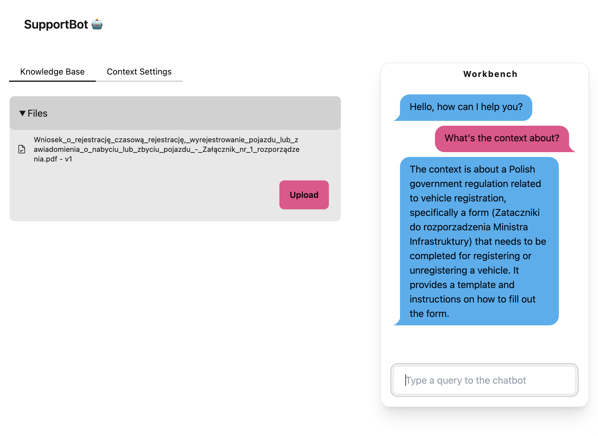
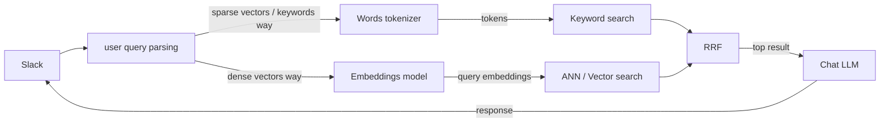
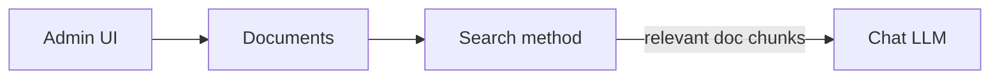

# supportbot-ch

An experimental AI support system for making private RAG powered internal **Slack** chatbots with ClickHouse and any Open AI compatible inference engine such as Ollama, Cortex, vLLM, or OpenRouter.



## Features
- RAG based on dense vector embeddings
- models and prompts customization
- bot contexts for documents, aka projects / workspaces
- admin UI
- slack integration

## Stack
- Scala 3, Cats Effect, sttp, http4s
- langchain4j (document chunking only)
- ClickHouse
- htmx, tailwind, daisy-ui

## Architecture

### Q&A system with hybrid search online retrieval and document ingestion



The above diagram shows the ideal hybrid search scenario.
**At the moment only the `dense vectors way` is implemented.** This already can be sufficient enough for many workloads. 
The `sparse vectors way` remains to be unimplemented due to ClickHouse's limitations, see the paragraph below for more.

The above could be enhanced with cross-encoder rerank step to trade-of some latency for potentially more relevant results. 



Document ingestion was designed to happen on-line through the admin UI and custom upload web-component by the power-users.

#### ClickHouse hybrid and full-text search considerations

ClickHouse doesn't store document frequency count per listing (index / doc), so we can't implement TF-IDF / BM25 retrieval mechanism easily using only the built-in full-text search index. We can do it only per entry like this: https://stackoverflow.com/a/60607452, which is not enough.

An alternative way of doing keyword search is to use sparse vectors / embeddings, which can be obtained using SPLADE / BGE-M3 models, but ironically, also the BM25.
Sparse vectors could be used in similar fashion as dense vectors with CH's `vector_similarity` index.

The BM25 model can be fit on each document and produce sparse embeddings, which will be then searched using the cosine similarity, just as dense embeddings.
BM25 model can be serializable, stored per context, loaded into app cache and updated on every doc ingestion.
This however has some limitations: the BM25 formula for the `avgdl` and `IDF` components requires the total number of documents. If the total number of documents is something that can change - for example when user uploads a new one, then each sparse embedding would need to be recalculated, which for a large document collection could be costly.

On the other hand, SPLADE / BGE-M3 models are promising but they are still active research area and it's not clear whether they can perform better in all cases for exact keyword search. Especially if the searched keyword is highly domain specific and wasn't included in the trained data. Moreover, these approached are harder to integrate with as there is not yet a standard interface api we can use like the Open AI api for chat completions and dense embeddings. This limits the amounts of potential deployments of the inference engines.

As last resort we can try out a mixed-approach for keyword search in which we will leverage the ClickHouse's experimental full text index only for its inverted index structure which will help with efficient keyword retrieval, but we will move the BM25 ranking to the application side, storing its metadata in dedicated table, and update it on each document ingestion. However, the additional table with the bag-of-words model for BM25 search, which has to be retrieved for each query can be quite large, even if implemented per some context. This would add operational and maintenance complexity, and make the whole solution less scalable.

## setup

1. Install scala-cli by following instructions in [here](https://www.scala-lang.org/download/) or [here](https://scala-cli.virtuslab.org/install).
3. Install Node through [NVM](https://github.com/nvm-sh/nvm) and run:
    ```zsh
    nvm use
    ```
2. Install [Just](https://github.com/casey/just)

## dev

0. See the `AppConfig` for config options

1. Create `local.env` file and load it with `set -a && . ./local.env && set +a`
  ```
  SLACK_SIGNING_SECRET=<your slack app signing>
  ```

2. Put some `.pdf` fixtures inside the `/app/content/` directory (or disable fixture loading in the `AppConfig`)

3. Run the ClickHouse
  ```zsh
  docker-compose -f ./docker-compose.yml up
  ```

4. Run Open AI API compatible inference engine such as Ollama

5. Run the app

  ```zsh
  just
  ```

6. Start the tunnel (only for slack app development)
  ```
  cloudflared tunnel --url http://localhost:8081
  ```

7. Add / modify the slack app manifest at https://api.slack.com/apps. Include the url from the cloudflare tunnel obtained above.
  ```yml
  _metadata:
    major_version: 1
    minor_version: 1
  display_information:
    name: supportbot
    description: SupportBot App
    background_color: "#080f06"
  features:
    bot_user:
      display_name: supportbot
      always_online: false
    slash_commands:
      - command: /supportbot
        url: https://principal-computed-worcester-encoding.trycloudflare.com/slack/slashCmd
        description: Ask the supportbot
        usage_hint: supportbot
        should_escape: false
  oauth_config:
    scopes:
      bot:
        - commands
  settings:
    org_deploy_enabled: false
    socket_mode_enabled: false
    token_rotation_enabled: false
  ```
